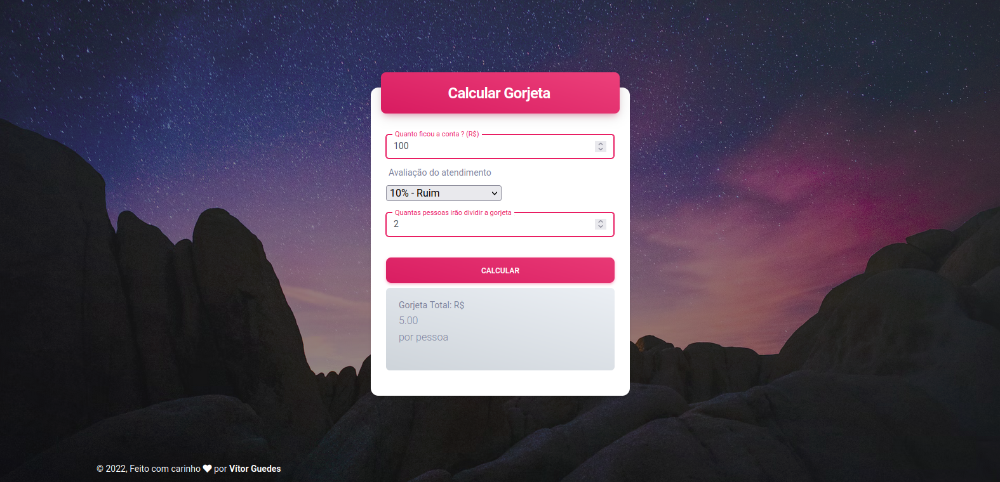

# :art: Layout

# :computer: Projeto
 
- Idealizador: Vítor Guedes
- Projeto: Base do desenvolvimento WEB
- Lado da força: Front-End e Back-End
- Etapa: Minicurso de entrada

# :clipboard: Apresentação

A `Base do desenvolvimento WEB`, passa pelo básico do front-end com:

- <em>Entendendo o HTML 5</em>: HTML é a base para criarmos páginas Web. Principais elementos e como criar um projeto prático com ele.

- <em>Entendendo o CSS 3</em>: O CSS é o que nos permite deixar nossas páginas bonitas e mais funcionais. Base do CSS e como estilizar o nosso projeto prático.

- <em>Entendendo o JS</em>: Com o JavaScript nós conseguimos deixar nossas páginas dinâmicas (reagindo ao que o usuário digita, a posição do mouse e etc).

# :rocket: Tecnologias

Esse projeto foi desenvolvido com:

